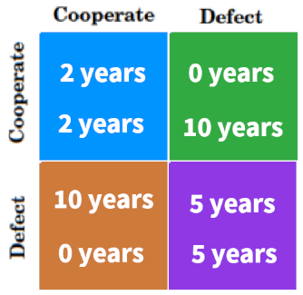
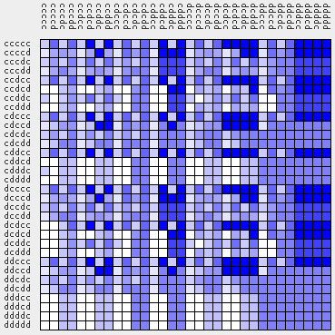

# Iterated Prisoner's Dilemma with one-step memory

The project undertakes the analysis of the iterated prisoner's dilemma with single-step memory. The main task is to create 32 strategies and then play a tournament where each strategy will compete against each other for 10 rounds. I will then analyze the data obtained and answer three questions: how do the polite strategies (those that start with C) perform? How do strategies that respond to an opponent's betrayal in the past perform? and how do those that respond to betrayal with cooperation perform?

Author:
- [Maksymilan Jackowski](https://github.com/makjac)

## Introduction

Imagine two people being interrogated. Both interrogators are suspected of committing some crime. There comes a moment when the detective asks them a question: who did the crime? Each interrogator has 2 choices: the first (cooperation), they can choose not to confess and remain silent to the question they are asked, or the second option (defect) they can blame it on their opponent. Each interrogator does not know what decision his opponent will make.

There are four possibilities for the interrogation to end:

- The player co-opts as his opponent does. Then both will get a 2-year prison sentence,

- The player cooperates, but his opponent betrays. The player is sentenced to 10 years in prison, and the opponent goes free immediately,

- the player betrays and his opponent cooperates. Then the player immediately goes free, and his opponent is sentenced to 10 years in prison,

- both cheat. As a result, both are sentenced to 5 years in prison.

This is a single prisoner's dilemma problem. In its iterated variant, players play several such dilemmas, and their final score is the sum of years earned for all rounds played. The more years of imprisonment obtained the worse.
## One-step memory

For IPD with one step memory, each strategy can be specified by the response (C or D) a player will take according to the last round played. Furthermore, the game requires the specification of the initial move  of  the  players.  In  each  round  of  game  between  two  players,  there  are  four  possible  outcomes  
((“my  move”      “opponent’s  move”)=DD,  DC,  CD,CC)  with  the  immediate  payoffs  P,  T,  S  and  R, respectively. In the context of one step memory, a player can recall his opponent's and his own strategy in  the  past  one  round.  They  can  have  responses  in  terms  of  strategy  ࣭Sp, St, Ss and Sr  for  the  DD, DC,  CD  and  CC  in  the  previous  step  respectively.  Together  with  the  initial  move S0,  we  can  encode  the strategy of IPD with one step memory by the following notation: S0|SpStSsSr. For example, GT is C|DDDC  and  Pavlov  is  C|CDDC.  Since  a  strategy  is  denoted  by S0|SpStSsSr which  have  five  bits and each slot encoded by either C or D, therefore, there are a total of 32 possible strategies in the strategy space Ms IPD with one step memory. 
## One-step memory results

## Random One-step memory
## Random One-step memory results

